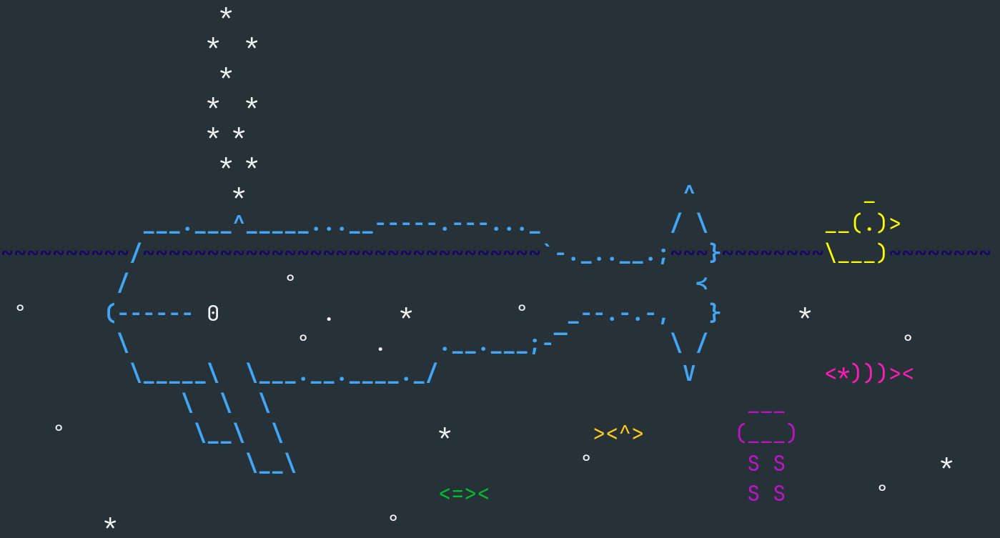
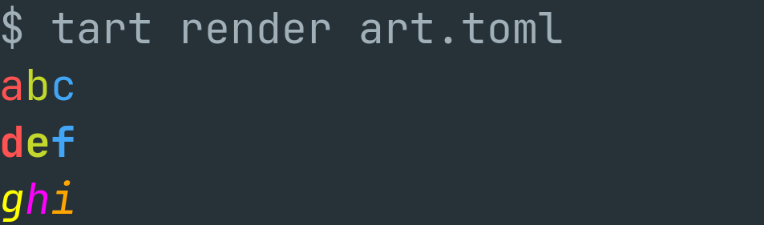

# tart

Text art renderer for the terminal.


## Installation

```bash
git clone https://github.com/ScriptSmith/tart.git
cd tart
cargo install --path .
```

## Usage

Create a TOML file with the following structure:

```bash
cat <<EOF > art.toml
design = '''
abc
def
ghi
'''

styles = '''
rgb
RGB
YPO
'''

[style_map]

[style_map.r]
foreground = "Red"
[style_map.g]
foreground = "Green"
[style_map.b]
foreground = "Blue"

[style_map.R]
foreground = "Red"
styles = ["Bold"]
[style_map.G]
foreground = "Green"
styles = ["Bold"]
[style_map.B]
foreground = "Blue"
styles = ["Bold"]

[style_map.Y]
foreground.RGB = [255, 255, 0]
styles = ["Italic"]
[style_map.P]
foreground.RGB = [255, 0, 255]
styles = ["Italic"]
[style_map.O]
foreground.RGB = [255, 165, 0]
styles = ["Italic"]
EOF
```

Then run the following command to render the text art:

```bash
tart render art.toml
```

The output should look like this:



See the help message for more information:

```
$ tart --help
Usage: tart <COMMAND>

Commands:
  render    Render the input file
  validate  Validate the input file
  schema    Print the JSON schema for the input file
  help      Print this message or the help of the given subcommand(s)

Options:
  -h, --help     Print help
  -V, --version  Print version
```

```
$ tart render --help
Render the input file

Usage: tart render [OPTIONS] <FILE>

Arguments:
<FILE>  Path to the input file

Options:
-t, --type <INPUT_TYPE>  Input file type [possible values: toml, json]
-h, --help Print help

```

## Input file schema

The input file schema is as follows:

```json
{
  "$schema": "http://json-schema.org/draft-07/schema#",
  "title": "Input",
  "type": "object",
  "required": [
    "design",
    "style_map",
    "styles"
  ],
  "properties": {
    "design": {
      "type": "string"
    },
    "style_map": {
      "type": "object",
      "additionalProperties": {
        "$ref": "#/definitions/InputStyles"
      }
    },
    "styles": {
      "type": "string"
    }
  },
  "definitions": {
    "InputColor": {
      "oneOf": [
        {
          "type": "string",
          "enum": [
            "Black",
            "Red",
            "Green",
            "Yellow",
            "Blue",
            "Purple",
            "Cyan",
            "White"
          ]
        },
        {
          "type": "object",
          "required": [
            "Fixed"
          ],
          "properties": {
            "Fixed": {
              "type": "integer",
              "format": "uint8",
              "minimum": 0.0
            }
          },
          "additionalProperties": false
        },
        {
          "type": "object",
          "required": [
            "RGB"
          ],
          "properties": {
            "RGB": {
              "type": "array",
              "items": [
                {
                  "type": "integer",
                  "format": "uint8",
                  "minimum": 0.0
                },
                {
                  "type": "integer",
                  "format": "uint8",
                  "minimum": 0.0
                },
                {
                  "type": "integer",
                  "format": "uint8",
                  "minimum": 0.0
                }
              ],
              "maxItems": 3,
              "minItems": 3
            }
          },
          "additionalProperties": false
        }
      ]
    },
    "InputStyle": {
      "type": "string",
      "enum": [
        "Bold",
        "Dimmed",
        "Italic",
        "Underlined",
        "Blink",
        "Reverse",
        "Hidden",
        "Strikethrough"
      ]
    },
    "InputStyles": {
      "type": "object",
      "properties": {
        "background": {
          "anyOf": [
            {
              "$ref": "#/definitions/InputColor"
            },
            {
              "type": "null"
            }
          ]
        },
        "foreground": {
          "anyOf": [
            {
              "$ref": "#/definitions/InputColor"
            },
            {
              "type": "null"
            }
          ]
        },
        "styles": {
          "type": [
            "array",
            "null"
          ],
          "items": {
            "$ref": "#/definitions/InputStyle"
          }
        }
      }
    }
  }
}
```

